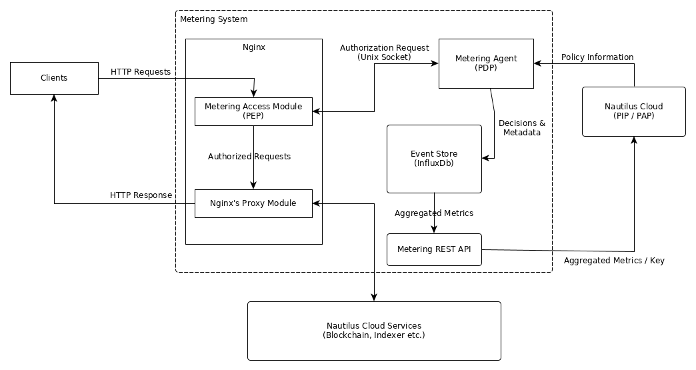

# Nautilus-Cloud-Metering
Metering services for Nautilus Cloud

## Introduction

This project provides a simple, fast and extensible layer for counting user
requests and enforcing various authorization policies. While designed to work with the
Nautilus Cloud ecosystem, the layer is generic and flexible enough to work in other
environments.

## Architecture


The layer is built around a nginx reverse proxy, a Scala based agent process for
authorizing client requests and an event store to record decisions and associated meta
data.

There are 3 main components:
1. **Nginx Module** : An access level module that constructs authorization requests based on
incoming client queries. These requests are forwarded to the agent process for evaluation.
The client request is either denied or permitted through the proxy based on the result of this evaluation. Multiple
instances of the module may be active within the same nginx process.

1. **Scala Agent** : Evaluates the authorization request based on policy
information fetched from an external source, in this case Nautilus Cloud. Once a decision
has been made and relayed to the nginx module, the agent also records the decision event
to the event store.

1. **Event Store** : A suitable data store for recording decisions. In the current
architecture, we utilize InfluxDB.

## Configuration

#### Nginx Configuration

Two separate configuration entries are required.

The first entry is a `load_module` directive that instructs nginx to load the metering
module. This directive must exist in `/etc/nginx/nginx.conf` file at the top level.

For example:
```
...

load_module modules/metered_access_module.so; # path relative to /etc/nginx/

events {
  ...
}

http {
  ...
}
```

The second set of entries are to be included in the `location` configuration block. The
following example shows how to enable the metering module for a site that serves
nginx's status page.

```
server {
  server_name  protected-service.some.domain;
  listen 9090;
  location /nginx_status {
    stub_status on;
    metered_access_ipc_fd_path "/tmp/metering.sock";
    metered_access on;
    metered_access_io_timeout 10;
    metered_access_extract_header "apiKey";
  }
}
```

The module can be enabled in multiple location blocks, to meter different sites simultaneously. To help the agent
process differentiate requests from different sites, the `metered_access_servername` directive can be used to
configure a tag which will be sent with each authorization request to the agent.

The following table explains the various directives available:

| Directive                     | Required | Argument to pass         | Description |
|-------------------------------|----------|--------------------------|-------------|
| metered_access_servername     | No       | Server / Service Name    | Name of the server that will be used to tag the authorization requests with. Defaults to `unset`.|
| metered_access_ipc_fd_path    | Yes      | Full path to socket file.| Must be writable by both agent process and nginx.|
| metered_access                | Yes      | on or off                | Turns the module on or off. In the off state all requests are assumed to be authorized. |
| metered_access_io_timeout     | Yes      | Timeout in seconds       | The time in seconds that the module should wait for an answer to an authorization request from the agent process before denying the associated client request. |
| metered_access_extract_header | No       | Name of HTTP header      | The name of the HTTP header to extract from the client request and send along with the authorization request. This directive can be repeated multiple times. If the header indicated by the directive does not exist, then no value will be emitted in the authorization request.|

A complete working example of the nginx configuration may be found [here](docker/loadtest/nginx.conf).

#### Agent Configuration

The Scala agent process is configured by providing an application config. A reference configuration with all fields may be found [here](src/main/reference.conf).


## Build

The requirements for the build process are:

1. The base development package for your distro should be installed. For example, in Arch Linux this would be
`base-devel` and in ubuntu it would be `build-essential`.
1. `libpcre++-dev zlib1g-dev libjansson-dev` should be installed. Check your distro's package manager for the
exact package name.
1. `sbt` should be installed. This project currently uses version 1.3.4.

Since both `C` and `Scala` code must be compiled, a shell script `make.sh` is provided for
managing the build process. This script also automates the download of the nginx source
code.

Before building the nginx version must be set in `make.sh` via the environment variable
`NGINX_VERSION`. Once set, compile the project by running `make.sh` without any arguments.

## Docker-based build

See the Docker-based deploy section below.

## Deploy

The requirements for deploying are:

1. The agent process must be installed on the same host as where nginx is running. It must
additionally run as the same user as the nginx worker processes. This is usually `http`
in most distributions.

1. Sudo access to install the compiled module file on the host on which nginx is running.

1. JRE 8 should be installed to run the agent itself.

Steps to deploy, build artifacts are available in the `target/` directory:

1. Copy the compiled module `metered_access_module.so` to `/etc/nginx/modules/`.
1. Configure nginx as written above.
1. Copy the agent jar file to the same host.
1. Start the agent via `java -jar metering-agent-x.y.jar`

## Docker-based deploy

For Docker base deploy follow these steps:
1. Be in the root directory of the repo.
1. Run `docker-compose up`. This starts the entire stack with a sample nginx configuration. See `docker/nginx.conf`.

## Load Testing

Results of a quick load test performed using the above mentioned docker-compose file and default settings. All time is in milliseconds.

```
================================================================================
---- Global Information --------------------------------------------------------
> request count                                       4800 (OK=4800   KO=0     )
> min response time                                      0 (OK=0      KO=-     )
> max response time                                  10023 (OK=10023  KO=-     )
> mean response time                                     6 (OK=6      KO=-     )
> std deviation                                        205 (OK=205    KO=-     )
> response time 50th percentile                          1 (OK=1      KO=-     )
> response time 75th percentile                          2 (OK=2      KO=-     )
> response time 95th percentile                          3 (OK=3      KO=-     )
> response time 99th percentile                          6 (OK=6      KO=-     )
> mean requests/sec                                     40 (OK=40     KO=-     )
---- Response Time Distribution ------------------------------------------------
> t < 800 ms                                          4798 (100%)
> 800 ms < t < 1200 ms                                   0 (  0%)
> t > 1200 ms                                            2 (  0%)
> failed                                                 0 (  0%)
================================================================================
```

The output was generated by [Gatling](https://gatling.io/) using the following scenario configuration:

```
package tech.cryptonomic.nautilus.metering

import io.gatling.core.Predef._
import io.gatling.http.Predef._
import scala.concurrent.duration._
import scala.util.Random

class HammerTest extends Simulation {
  val s = scenario("One Valid One Invalid")
      .exec(http("Valid ApiKey").get(session => "/nginx_status").headers(Map("apiKey" -> "engage")))
      .exec(http("Invalid ApiKey").get(session => "/nginx_status").headers(Map("apiKey" -> "engage2")).check(status.is(403)))
  val httpOptions = http.baseUrl("http://localhost:9090")
  setUp(s.inject(constantUsersPerSec(20) during (120 seconds)).protocols(httpOptions))
}
```
